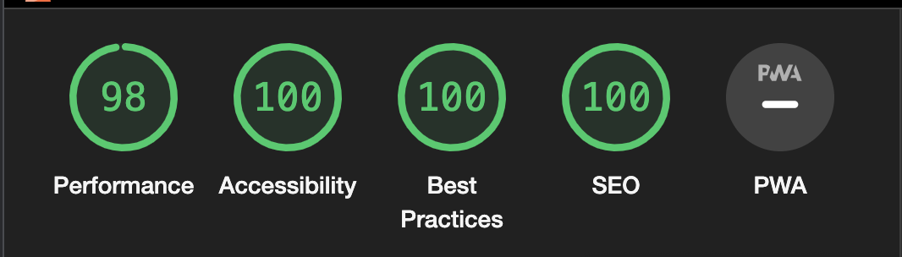
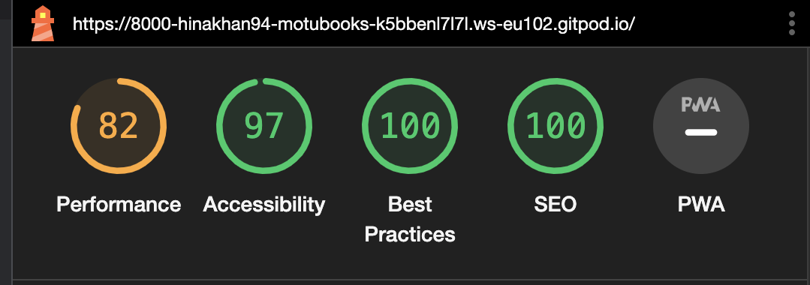

# Motubooks

MotuBooks is a family friendly company. It represents the importance of influence that innovative and cultural-based books have on children’s growth. MotuBooks highlights the key role that parents play in choosing valuable books for their kids. 

When working Hand in Hand with Motubooks, parents can influence their child’s future for the best by choosing the right and playful books for their Children.

## Features
### Existing features
- Navigation Bar
  * featured on all two pages, the bar includes links to the home, categories, sign up and blog pages.
  * This will allow the users to properly and easily navigate through out the website on all devices without pressing the 'back' button everytime.

- The Landing Page Image
  * The landing page has an image with a cover text to show where the user is 
  * The image was added to grab the user's attention and to make it interesting for the audience to stay on the webpage.
  * The image shows kids which also explains the website's purpose that it is a kids website.

### About Us Section

  * The about us section tells the user the story and purpose of the website and why is it important to choose the right books for kids.
  * This section also highlights the keyrole of parents in shaping their kids future. 

### Categories Section

 * This section introduces Motubooks 4 Age Categories of books to choose from with images and covertext to look intersting to the user.
 * The categories also have a hover function so it is also playful and gives off a friendly vibe.
 * The four categories are following:
   * BedTime Stories (Age:3-6)
   * Early Reader (Age:5-9)
   * Juvenile Reader (Age:7-9)
   * Middle Grade (Age:8-12)
   

### Sign Up Section

- This section allows the user to sign up to our Newsletter to join the motubooks community and recieve updates about our latest addition in the audio books categories.

### Footer
- The footer has all the relevant social media links. The links opens a new window to alloy smooth navigation for the audience.

### Features left to add
* Blog page
  * The blog has an active header, footer, and a body section with article but it still needs styling and images with a comments box at the end for users to interact and provide feedback.  

## Testing
### Validator Testing
- HTML 
  * No errors were found when passing through the recommended [W3C Validator](https://validator.w3.org/nu/?doc=https%3A%2F%2F8000-hinakhan94-motubooks-k5bbenl7l7l.ws-eu102.gitpod.io%2Findex.html)
- CSS
  * No errors were found when passing through the recommended [Jigsaw Validator](https://jigsaw.w3.org/css-validator/validator?uri=https%3A%2F%2Fvalidator.w3.org%2Fnu%2F%3Fdoc%3Dhttps%253A%252F%252F8000-hinakhan94-motubooks-k5bbenl7l7l.ws-eu102.gitpod.io%252Findex.html&profile=css3svg&usermedium=all&warning=1&vextwarning=&lang=en)

### Lighthouse Testing
- Desktop View

- Mobile View 

### Browser Testing
- Chrome
- Safari
- Mozilla Firefox

## Deployment
- The site was deployed to Github pages, the process of deployment that I followed is as below:
  * In the Github repositiory section, went to the settings tab
  * From the source section drop-down menu, chose the Master Branch
  * Once the master branch was selected, the page automatically refreshed and displayed a successfull deployment
The link can be viewed here: 

## Credits
I would like to thanks my mentor Oluwafemi for his constant support and guidance through out the completion of the project.

### Content
- The instructions to how to add styling to the submit button and form was taken from [W3schools](https://www.w3schools.com/howto/howto_css_form_icon.asp) and [Coding Snow](https://www.youtube.com/watch?v=Pcf4F5xa1xs).
- The icons in the sign up form was taken from [Font Awesome](https://fontawesome.com/icons/user?f=classic&s=regular).
- The font was taken from [Google Fonts](https://fonts.google.com/).
- The instruction to proper implementation of the structure, redame file and deployment was taken from [code institute](https://github.com/Code-Institute-Solutions/love-running-v3).

### Media
- The images were taken from [Raw Pixels](https://www.rawpixel.com/).
  * [Hero Image](https://www.rawpixel.com/image/6522392/large-group-children-collage-element-psd)
  * [Image1 in Categories](https://www.rawpixel.com/image/84271/premium-photo-image-book-kid-kids-read)
  * [Image1 in Categories](https://www.rawpixel.com/image/659395/free-image-rawpixel)
  * [Image1 in Categories](https://www.rawpixel.com/image/83553/premium-photo-image-activity-asian-book)
  * [Image1 in Categories](https://www.rawpixel.com/image/659583/free-image-rawpixel)

