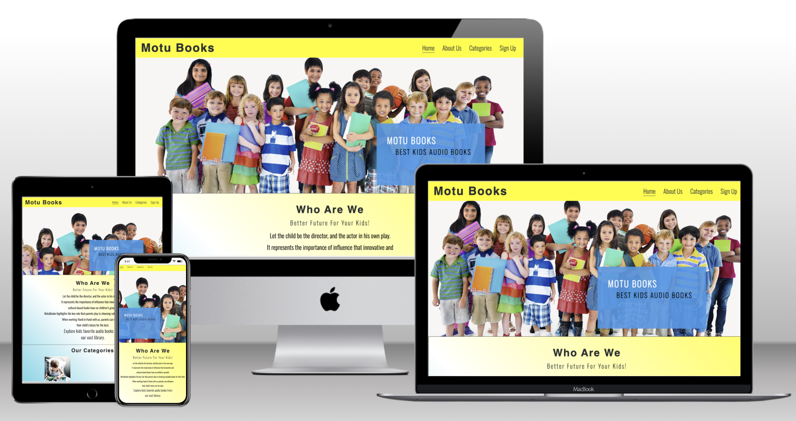

# Motubooks

## A live demo of the website can be found [here](https://hinakhan94.github.io/motu-books/)

## UX

The target users of the website are the parents and their children. This is why the site is focused on simplicity and ease of navigation for all ages.

## User Stories

MotuBooks is a family friendly company. It represents the importance of influence that innovative and cultural-based books have on children’s growth. MotuBooks highlights the key role that parents play in choosing valuable books for their kids. 

When working Hand in Hand with Motubooks, parents can influence their child’s future for the best by choosing the right and playful books for their Children.

## Strategy 
The idea is to make a fully fucntioning audio books library for parents and kids to choose from, keeping the design very simple, friendly and creative.

## Scope 

The overall scope of the project is to give importance to books (especially audio books) and the value they bring into one's lifestyle and in particular how books help in shaping the personality and future of kids. Like mentioned above, it also caters to parents who want to play an active role in their kids upbringing, making the whole process not boring. Reading a book can be boring for some but listening to it when different sounds is quite an interesting thing to do.

## Structure

The website has a single scrolling page with different sections to navigate through. The structure features a fixed navigation bar and when clicked, it takes the user to the desired section.

## Website Sections
- Home/Landing page: Takes it to the hero image with a cover text of what the site is all about.
- About us: A brief intorduction of Motubooks
- Categories: lists 4 different categories targeting 4 different age groups (early reader, juvenile reader, middle grade and bedtime stories)
- Sign up: allows the user to sign up for our newsletter 
- Footer: lists down all the social networks with clickable links
  
## Skeleton 
The website is a simple one page structure with flows from top to bottom.

The initial sketch was made using Balsamic Wireframes. It was discussed and motified with the guidance of my mentor.
You can view the draft [here](assets/readme.docs/draft.pdf)

## Surface

I have used plain colors with liner-gradient as my background color.

### Main color palette

- Blue #2B2F31 (A father's trust, loyalty and stability)
- Yellow #ffff00, ([rgba(255,255, 0, 0.5)]) (A mother's enlightenment and creativity)
- White #fff (an innocent and peacful child)
- Gray #3a3a3a

## Technologies

- HTML
- CSS
- Balsamiq wireframes

## Features
### Existing features
- Navigation Bar
  * featured on all two pages, the bar includes links to the home, categories, sign up and blog pages.
  * This will allow the users to properly and easily navigate through out the website on all devices without pressing the 'back' button everytime.

- The Landing Page Image
  * The landing page has an image with a cover text to show where the user is 
  * The image was added to grab the user's attention and to make it interesting for the audience to stay on the webpage.
  * The image shows kids which also explains the website's purpose that it is a kids website.

### About Us Section

  * The about us section tells the user the story and purpose of the website and why is it important to choose the right books for kids.
  * This section also highlights the keyrole of parents in shaping their kids future. 

### Categories Section

 * This section introduces Motubooks 4 Age Categories of books to choose from with images and covertext to look intersting to the user.
 * The categories also have a hover function so it is also playful and gives off a friendly vibe.
 * The four categories are following:
   * BedTime Stories (Age:3-6)
   * Early Reader (Age:5-9)
   * Juvenile Reader (Age:7-9)
   * Middle Grade (Age:8-12)
   

### Sign Up Section

- This section allows the user to sign up to our Newsletter to join the motubooks community and recieve updates about our latest addition in the audio books categories.

### Footer
- The footer has all the relevant social media links. The links opens a new window to alloy smooth navigation for the audience.

### Features left to add
* Blog page
  * The blog has an active header, footer, and a body section with article but it still needs styling and images with a comments box at the end for users to interact and provide feedback.  

## Testing
### Validator Testing
- HTML 
  * No errors were found when passing through the recommended [W3C Validator](https://validator.w3.org/nu/?doc=https%3A%2F%2F8000-hinakhan94-motubooks-k5bbenl7l7l.ws-eu102.gitpod.io%2Findex.html)

  
- CSS
  * No errors were found when passing through the recommended [Jigsaw Validator](https://jigsaw.w3.org/css-validator/validator?uri=https%3A%2F%2Fvalidator.w3.org%2Fnu%2F%3Fdoc%3Dhttps%253A%252F%252F8000-hinakhan94-motubooks-k5bbenl7l7l.ws-eu102.gitpod.io%252Findex.html&profile=css3svg&usermedium=all&warning=1&vextwarning=&lang=en)

  

### Lighthouse Testing
- Desktop View

- Mobile View 

### Browser Testing
- Chrome
- Safari
- Mozilla Firefox

## Deployment
- The site was deployed to Github pages, the process of deployment that I followed is as below:
  * In the Github repositiory section, went to the settings tab
  * From the source section drop-down menu, chose the Master Branch
  * Once the master branch was selected, the page automatically refreshed and displayed a successfull deployment
The link can be viewed [here](https://hinakhan94.github.io/motu-books/) 

## Forking & Cloning Instructions
* To create a copy of the repo in GitHub to edit:
1. Log in to your GitHub account.
2. Navigate to [motu-books repository](https://github.com/HinaKhan94/motu-books)
3. Click on the "Fork" button located in the upper right-hand corner of the repository's page.
4. Select the account where you want to fork the repository.
5. Wait for GitHub to complete the forking process.
6. Open the project in GitPod (or whichever IDE you have setup)

* To clone a copy of the repo on your local machine to edit:
1. Log in to your GitHub account.
2. Navigate to [motu-books repository](https://github.com/HinaKhan94/motu-books)
3. Click on the "Code" button located in the upper right-hand corner of the repository's page.
4. Click on the "HTTPS" link to copy the URL of the repository.
5. Open the terminal or command prompt on your local machine and navigate to the directory where you want to clone the repository.
6. Type the following command, replacing the "repository_URL" with the URL of the repository that you copied in step 4: git clone repository_URL.
7. Press Enter and wait for the cloning process to complete.

## Bugs
### Solved Bugs
  * I had an issue with my categories section not responding well on mobile view but then with the help of my mentor I was able to detect the issue and it was because the height was fixed and did not adjust to the changing of the screen sizes.

### Unsolved Bugs
  * No unsolved bugs
  
## Credits
I would like to thanks my mentor Oluwafemi Medale for his constant support and guidance through out the completion of the project.

### Content
- The instructions to how to add styling to the submit button and form was taken from [W3schools](https://www.w3schools.com/howto/howto_css_form_icon.asp) and [Coding Snow](https://www.youtube.com/watch?v=Pcf4F5xa1xs).
- The icons in the sign up form was taken from [Font Awesome](https://fontawesome.com/icons/user?f=classic&s=regular).
- The font was taken from [Google Fonts](https://fonts.google.com/).
- The instruction to proper implementation of the structure, redame file and deployment was taken from [code institute](https://github.com/Code-Institute-Solutions/love-running-v3).

### Media
- The images were taken from [Raw Pixels](https://www.rawpixel.com/).
  * [Hero Image](https://www.rawpixel.com/image/6522392/large-group-children-collage-element-psd)
  * [Image1 in Categories](https://www.rawpixel.com/image/84271/premium-photo-image-book-kid-kids-read)
  * [Image1 in Categories](https://www.rawpixel.com/image/659395/free-image-rawpixel)
  * [Image1 in Categories](https://www.rawpixel.com/image/83553/premium-photo-image-activity-asian-book)
  * [Image1 in Categories](https://www.rawpixel.com/image/659583/free-image-rawpixel)

